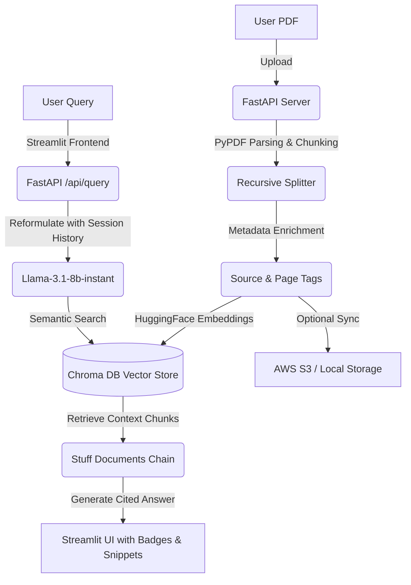

# 🧠 DocuMind: Enterprise-Grade RAG-Based Document Intelligence System

DocuMind is an interview-grade, production-ready Retrieval-Augmented Generation (RAG) system. It features a high-performance **FastAPI backend** and a premium, dark-mode/glassmorphic **Streamlit frontend**. The system indexes PDF documents, persists them in a local **Chroma DB** vector store, and provides intelligent, conversational question-answering with exact **inline page citations** and **retrieved source snippet views** powered by **Groq Llama-3.1-8b-instant**.

---

## 🌟 Key Features

*   **Premium Glassmorphic UI:** Built with a modern, customized dark-mode aesthetic utilizing HSL Tailwind-like colors and fluid animations.
*   **Fast API Architecture:** Fully isolated RESTful API endpoints for uploading, listing, deleting documents, querying, and managing session histories.
*   **Local Vector DB & Embeddings:** Persisted ChromaDB utilizing HuggingFace's local embedding model (`all-MiniLM-L6-v2`) for quick semantic lookups.
*   **Conversational History-Aware Retrieval:** Reformulates subsequent user queries based on context history to support continuous, multi-turn dialogue.
*   **Smart Citation & Snippet Viewer:** Appends clickable, colorized page-number badges (`[📄 filename.pdf (P. X)]`) to factual statements and embeds source blockquotes in the UI.
*   **AWS S3 Storage with Local Fallback:** Supports cloud document sync via Boto3, with automatic fallback to local disk storage if AWS keys are not configured.
*   **Production Deployment Ready:** Includes Nginx proxy configs and Systemd service templates for robust staging/production deployment.

---

## 🏗️ Architecture Flow



---

## 🛠️ Technology Stack

*   **LLM Inference:** [Groq Cloud API](https://console.groq.com/) (`llama-3.1-8b-instant`)
*   **Orchestration:** LangChain (LCEL)
*   **Vector Database:** Chroma DB
*   **Embedding Model:** HuggingFace `all-MiniLM-L6-v2` (runs locally)
*   **Backend Framework:** FastAPI (Uvicorn web server)
*   **Frontend Interface:** Streamlit
*   **File Storage:** AWS S3 (via Boto3) / Local Storage Fallback

---

## 🚀 Setup & Installation

### Prerequisites
*   Python 3.11+
*   A **Groq API Key** (Get it free at [Groq Console](https://console.groq.com/))

### 1. Clone & Navigate to Project
```bash
cd P:\Praneeth\College\Projects\RAG
```

### 2. Create and Activate Virtual Environment
```bash
python -m venv .venv
# On Windows:
.\.venv\Scripts\activate
# On macOS/Linux:
source .venv/bin/activate
```

### 3. Install Dependencies
```bash
pip install -r requirements.txt
```

### 4. Configure Environment Variables
Create a file named `.env` in the root directory (based on `.env.example`):
```env
GROQ_API_KEY=gsk_your_actual_groq_api_key_here
CHROMA_DB_DIR=chroma_db
EMBEDDING_MODEL_NAME=all-MiniLM-L6-v2
LLM_MODEL_NAME=llama-3.1-8b-instant

# Optional AWS S3 Configurations (Leaves empty for local fallback storage)
AWS_ACCESS_KEY_ID=
AWS_SECRET_ACCESS_KEY=
AWS_REGION=us-east-1
AWS_S3_BUCKET_NAME=
```

---

## 🏃 Run the Application

You need to run both the FastAPI Backend and the Streamlit Frontend.

### 1. Start the Backend API Server
In your terminal (with the virtual environment activated), run:
```bash
python main.py
```
*The API will start listening on `http://127.0.0.1:8000`.*

### 2. Start the Streamlit Frontend Client
Open a **new terminal**, navigate to the project directory, activate the `.venv`, and run:
```bash
streamlit run app.py --server.port 8502
```
*The interface will automatically open in your browser at `http://localhost:8502`.*

---

## 🧪 Running Tests

The project includes unit and integration tests covering ingestion, querying, API routing, and storage fallbacks.
To run the test suite:
```bash
pytest tests/
```

---

## 📦 Deployment Configuration

Production deployment service files can be found in the `deployment/` directory:
*   `documind_api.service` & `documind_ui.service`: Systemd service configurations.
*   `nginx.conf`: Nginx reverse-proxy setup for domain bindings.
*   `.github/workflows/deploy.yml`: GitHub Actions CI/CD configuration.
